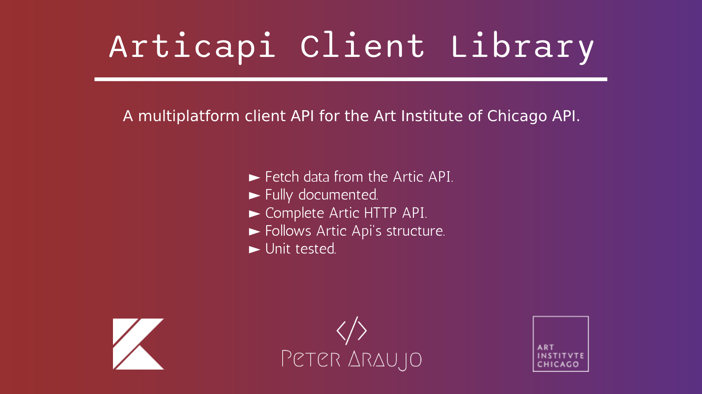

# Artic API Client

[](https://kotlinlang.org)
[](https://gradle.org/)
[](https://www.apache.org/licenses/LICENSE-2.0)
[](https://central.sonatype.com/namespace/com.peteraraujo.articapi)
[](https://github.com/peteraraujo/)



## Features

* Fetch data from the Artic API
* Fully documented.
* Complete [Artic HTTP API](https://api.artic.edu/) integration. All fields, endpoints and parameters are supported.
* Follows Artic Api's structure.
* Powered by KTor.
* Kotlin Multiplatform support.
  * Current platforms:
    * JVM (works on Android)
    * JS
    * Linux
    * Windows Native
* Unit tested.

## Installation

Artic API Client is available on Maven Central. To add it to your project, include the dependency below.

### `build.gradle.kts`
```kotlin
implementation("com:peteraraujo.articapi:articapi-client:1.0.1")

// If using toml libs:
implementation(libs.articapi.client)
```

### `build.gradle`
```groovy
implementation 'com:peteraraujo.articapi:articapi-client:1.0.1'

// If using toml libs:
implementation(libs.articapi.client)
```

### `libs.versions.toml`
```toml
[versions]
articapiclient = "1.0.1"

[libraries]
articapi-client = { module = "com:peteraraujo.articapi:articapi-client", version.ref = "articapiclient" }
```
Check complete versioning and dependencies information on the [project's GitHub Wiki](https://github.com/peteraraujo/articapi-client/wiki).

## Versioning
The following chart shows the versions of Artic Api Client dependencies.

| Artic API Client | Kotlin | KTor   |
|------------------|--------|--------|
| 1.0.1            | 2.0.0  | 2.3.11 |

## Usage
### Getting a service
There is a service per [resource](https://api.artic.edu/docs/#fields).
For example, [Artwork](https://api.artic.edu/docs/#collections-2) service:
```kotlin
val artworkService = ArtworkService()
```

### Using a service
Each _field_ has its own [endpoints](https://api.artic.edu/docs/#endpoints).
Services are "resource specific", so each has certain functions depending on the endpoints available to it.\
_Note: service functions are `suspend`._\
For example, when using `ArtworkService`, you'll have access to [artwork-specific endpoints](https://api.artic.edu/docs/#artworks):

```kotlin
val artworkService = ArtworkService()

val getByIdResult = artworkService.getById(id = 3)
val getArtworks = artworkService.getItems(limit = 2)
val searchArtworks = artworkService.search(search = "Paris")
val getArtworkManifest = artworkService.getArtworkManifest(id = 3)
```

Check complete documentation on the [project's GitHub Wiki](https://github.com/peteraraujo/articapi-client/wiki).

## Contributing and Issues

If you encounter any issues or have found an error in this project, 
please [file an issue](https://github.com/peteraraujo/articapi-client/issues).
I appreciate your feedback and will do my best to address the problem promptly.
Also, contributions are welcome to this project.
If you're interested in contributing, please check out the [Code of Conduct](CODE_OF_CONDUCT.md) for more details on how to get started and the expected standards from all contributors.

## Future Features
- Add support on other platforms, like Apple's platforms.

## Acknowledgments
* The Artic ([api.artic.edu](https://api.artic.edu)) team for providing an amazing server API.

## Contact
If you have any questions or suggestions, feel free to [contact me](https://github.com/peteraraujo).